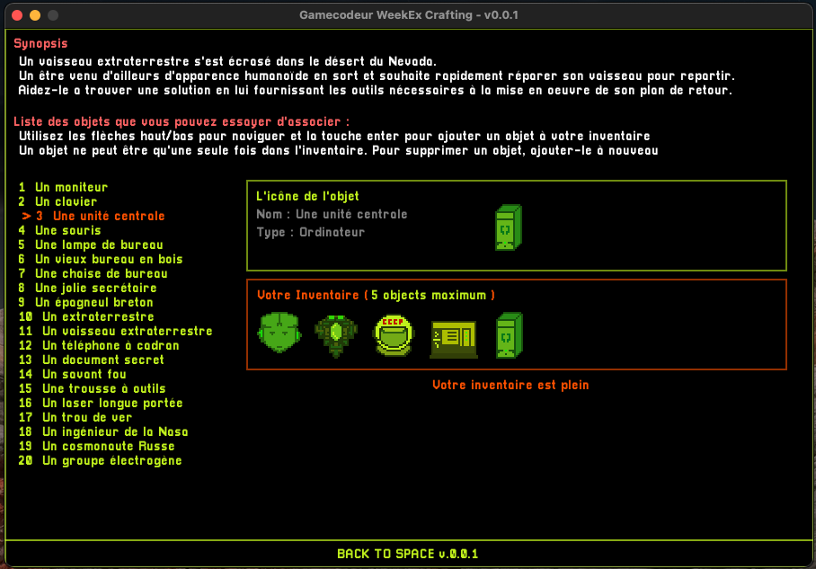

# Back To Space 

### [English description]

Prototype of a small game whose objective is to put in its inventory the right items to send our alien back into space.

### [French description]

Prototype d'un petit jeu dont l'objectif est de mettre dans son inventaire les bons objets pour renvoyer notre extraterrestre dans l'espace.

### [General informations]

**Warning, actually this source code is not functionnal, for developper only  (this project is under development).**

* Version : 0.0.1 
* Environment : Lua / LÔVE2D
* License : GNU GPL v3 (see LICENSE file)

### [Flyer]

